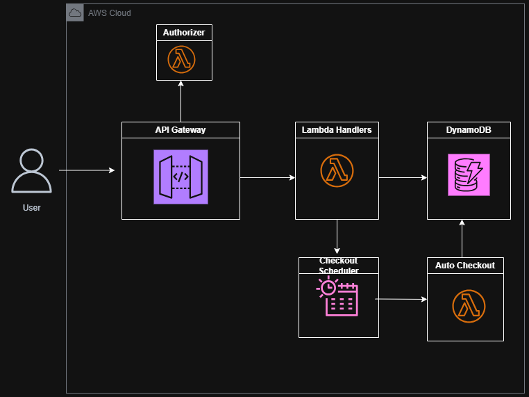
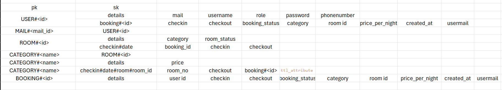
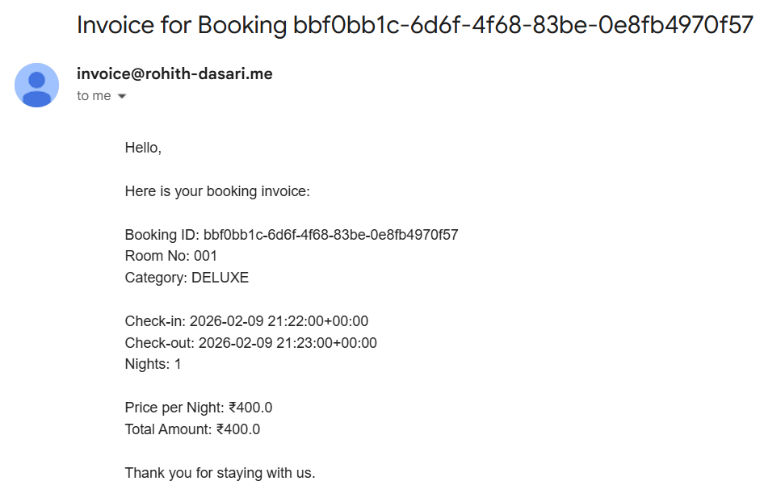

# Hotel Auto Checkout System

## Problem Statement
Design a backend service to manage hotel room bookings and automatic guest checkouts.  
The system tracks booking lifecycles and room availability, automatically triggers check-out when the booking period ends, generates a simple invoice on checkout, and updates room status accordingly.

## Swagger Docs

---

## System Architecture

---

## Access Patterns
1. Get user by email  
2. Get user by ID  
3. Create user  
4. Get bookings by user  
5. Get rooms by category  
6. Get price by category  
7. Update room by ID  
8. Update booking by ID  
9. Get available rooms by check-in and check-out date range  
10. Create booking  

---

## DynamoDB Schema

## Auto Checkout
Upon checkout, EventBridge Scheduler generates invoice, updates  room & book status and emails the invoice to the customer. Below is such invoice generated and mailed:
